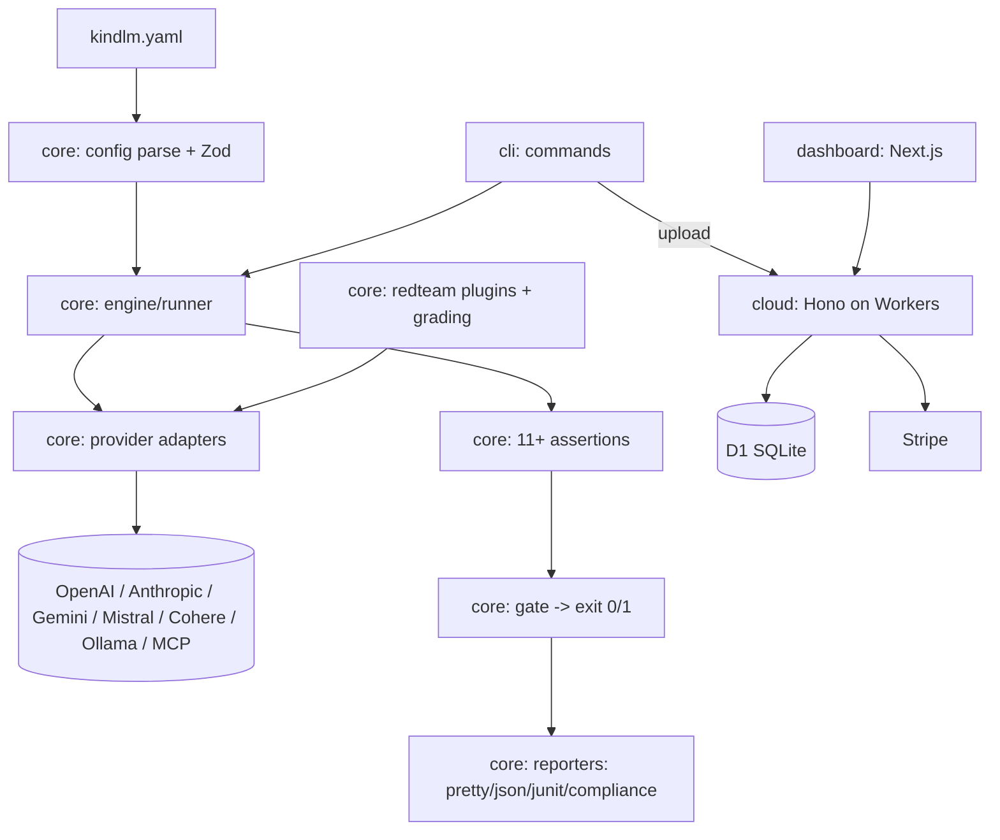

# KindLM — Project Survey

> Standardized single-repo survey. Evidence is drawn only from this repository plus external market research on the AI-agent-evaluation category. Zero revenue, zero confirmed users, and provisional pricing are assumed unless the repo proves otherwise.
>
> Analysis date: 2026-05-29

---

## 1. Executive summary

- **Project name:** KindLM
- **One-line description:** Open-source CLI that runs behavioral regression tests against AI agents (tool calls, decisions, structured output) and gates CI on the results.
- **What the product appears to do:** Parse a `kindlm.yaml` suite → call any of 7 LLM providers → run 11+ assertion types (tool calls, JSON schema, PII, LLM-judge, drift, keywords, latency, cost) → emit pass/fail with exit code 0/1 → optionally generate EU AI Act Annex IV compliance docs and upload runs to a paid Cloud dashboard. A new red-team module generates OWASP-category adversarial probes and grades the target's responses.
- **Current maturity:** **Deployed product** (shipped open-source CLI on npm + live Cloud Worker at api.kindlm.com + published VS Code extension + GitHub Action). Two new capability areas (v2.4.0 rigor metrics, red-team) are mid-build.
- **Current commercial status:** Assume **zero users, zero revenue, zero MRR.** Stripe billing code exists and is described as "live mode" in planning notes, but there is **no paying-customer evidence in the repo.** Treated as not validated.
- **Main buyer or user:** Engineering / ML-platform teams shipping LLM agents into production who need regression tests in CI; secondarily, EU-regulated teams needing AI Act documentation.
- **Main value proposition:** "Test what the agent *does*, not just what it says — and fail the build when behavior regresses." Provider-neutral, local-first, CI-gating, compliance-ready.
- **Main monetization model (suggested):** Open-core. MIT CLI free forever; paid Cloud (Team $49/mo, Enterprise $299/mo) for dashboard, history, compliance PDF, SSO/audit.
- **Pricing proven or provisional:** **Provisional.** Prices are in docs and Stripe plan keys, but no evidence of a single paid conversion.
- **Overall repo evidence confidence:** **High** (large, coherent, well-documented monorepo with tests).
- **Overall market research confidence:** **Medium-High** (rich category research with sources; no direct customer interviews for *this* product).
- **Short verdict:** **Worth finishing — but validate demand before deepening Cloud.** The CLI is the asset; the open-source wedge is strong and timely (Promptfoo→OpenAI trust vacuum). Revenue is unproven and the paid Cloud is the weakest-validated part.

---

## 2. Evidence inventory

| Evidence area | Found? | Files inspected | What it proves | What it does NOT prove |
|---|---|---|---|---|
| Product UI | Partial | `packages/dashboard/app/*`, `site/components/LandingPage.tsx` | Next.js dashboard (runs, projects, settings, billing, login) + a marketing site exist in source | That either is deployed, used, or converts |
| Backend/API | Yes | `packages/cloud/src/routes/*` (14 route files), `src/index.ts` | Hono REST API: auth, oauth, sso, projects, suites, runs, results, baselines, compare, compliance, members, billing, audit, webhooks | Live traffic, uptime, or real orgs |
| Auth | Yes | `routes/auth.ts`, `oauth.ts`, `sso.ts`, `middleware/auth.ts` | GitHub OAuth + bearer-token API auth + SAML SSO scaffolding | Any registered users |
| Database | Yes | `packages/cloud/src/db/queries.ts`, wrangler.toml D1 binding, 14 migrations referenced | D1 (SQLite) schema: orgs, users, projects, test_runs, test_results, billing | That production DB holds real records |
| Payments | Yes (code) | `routes/billing.ts` | Stripe Checkout + customer creation + plan keys (team/enterprise); returns 501 if `STRIPE_SECRET_KEY` unset | Any completed payment or active subscription |
| Tests | Yes (extensive) | `*.test.ts` colocated across all packages; cloud routes each have a test | Strong unit/integration discipline | Full green suite (5 known `scenarios.test.ts` failures admitted) |
| CI/CD | Yes | GitHub Actions referenced in CLAUDE.md, `deploy-site` workflow in git log | Lint/typecheck/test/build/deploy pipeline | That deploys currently succeed in prod |
| Deployment | Yes | `wrangler.toml` (api.kindlm.com route, prod D1 id, cron), npm `bin`, VS Code packaging | Real deploy targets configured | Current live status verifiable only externally |
| Monitoring | Yes | `@sentry/cloudflare` dep, "Sentry active" in planning | Error monitoring wired | Volume / that anything is being observed |
| Documentation | Strong | `README.md`, `docs/*`, `.claude/CLAUDE.md`, `.planning/*` | Deep, current internal docs + market research | External user-facing doc traffic |
| Landing / marketing | Yes | `site/` (Next.js), `docs/11-PRICING.md`, archived landing prototype | A marketing site + pricing page exist | Visitors, signups, conversion |
| CLI / SDK | Yes (core) | `packages/cli` (`kindlm` bin), `packages/core` (npm `@kindlm/core`) | A real, published, multi-command CLI | npm download counts (not in repo) |
| Integrations | Yes | 7 provider adapters + MCP, OTLP trace ingest, GitHub Action, Slack webhook formatter | Broad provider/CI/observability surface | That integrations are used in anger |
| Security | Partial | `middleware/auth.ts`, `rate-limit.ts`, `plan-gate.ts`, `crypto/envelope.ts` | Bearer auth, per-org rate limit, plan gating, envelope encryption | Independent security review / pen test |
| Compliance | Yes (code) | `reporters/compliance.ts`, EU AI Act mapping | Annex IV markdown generation + SHA-256 hashing | Legal validation; research notes the mapping is incomplete vs real Annex IV |
| Analytics | Not proven | — | — | No product-analytics / activation tracking found |
| User/account mgmt | Yes (code) | `routes/members.ts`, orgs/roles in schema | Org + role + member management modeled | Real accounts exist |

---

## 3. Product description from repo evidence

**What it is.** KindLM is a TypeScript monorepo (`core`, `cli`, `cloud`, `dashboard`, `vscode`, plus a `site/`) implementing a behavioral regression-testing tool for LLM agents. The CLI is the core product; Cloud is the paid add-on.

**Problem it solves.** Agents change behavior silently when prompts, models, or provider versions shift. Standard text-similarity evals miss *behavioral* regressions (wrong tool, wrong arguments, wrong order, leaked PII). KindLM asserts on what the agent *does* and gates CI on it (exit code 0/1).

**Who it is for.** Engineers and ML-platform teams putting agents in production; CI/CD owners; and (secondarily) compliance owners at EU-regulated AI vendors facing the Aug 2, 2026 AI Act deadline.

**Main workflow (repo-grounded).**
1. `kindlm init` scaffolds `kindlm.yaml`.
2. Define providers, models, prompts, tests with `expect:` assertions.
3. `kindlm test` runs the suite (concurrency, retries, timeouts, repeat, caching, watch mode).
4. Assertions evaluate; gates decide pass/fail; reporters emit pretty / JSON / JUnit / compliance.
5. Optional: `kindlm baseline set|compare` for drift; `kindlm trace` ingests OTLP; `kindlm upload` pushes to Cloud; `kindlm redteam init|run` for adversarial testing.

**Main features (implemented, per source).** Tool-call assertions, JSON-schema validation (AJV), PII detection, LLM-as-judge, baseline drift, keyword guards, latency/cost budgets, multi-turn conversations, response caching, watch mode, worktree isolation, compliance reports, 7 providers + MCP, GitHub Action, VS Code intellisense.

**Planned / mid-build (per `.planning/ROADMAP.md`).** v2.4.0 "Rigor & Reach" (Phases 19–28): default repeat=3, `pass^k`/`pass@k`, percentile latency, bootstrap CIs, trajectory metrics, judge bias mitigation, failure-first terminal, sticky PR comment, GH annotations, tool-call diff, multi-file suite composition + `kindlm lint`, compliance PDF restructure, docs refresh, tech-debt fix. Red-team milestone (M001): 8 OWASP plugins + policy plugin, attack generation, LLM-judge grading, run orchestrator, vulnerability report, `kindlm redteam run` CLI — **all landed in recent commits.**

**Unclear.** Whether Cloud has any real tenants; whether the marketing `site/` is deployed; actual npm adoption.

---

## 4. Feature completeness

| Feature | Status | Evidence | Notes |
|---|---|---|---|
| Config parse + Zod validation | Implemented | `config/schema.ts`, `parser.ts`, "did you mean" suggestions | Mature; fuzz-tested per docs |
| 7 provider adapters + MCP | Implemented | `providers/*.ts` (openai, anthropic, gemini, mistral, cohere, ollama, mcp) | Broad neutrality is a moat |
| Tool-call / schema / PII / keyword assertions | Implemented | `assertions/*.ts` (one file per concern) | Core differentiator |
| LLM-as-judge | Implemented | `assertions/judge.ts`, multi-pass behind flag | Judge bias mitigation still planned (Phase 21) |
| Baseline drift detection | Implemented | `baseline/*`, `assertions/drift.ts` | Versioned, never-overwrite |
| Latency + cost budgets | Implemented | `assertions/latency.ts`, `cost.ts`, `providers/pricing.ts` | |
| Reporters (pretty/json/junit/compliance) | Implemented | `reporters/*.ts` | Failure-first restructure planned |
| Compliance Annex IV report | Partially implemented | `reporters/compliance.ts` | Research: mapping incomplete vs real Annex IV (no exec summary, no structured elements, no signed logs) |
| CLI commands (init/validate/test/trace/baseline/login/upload) | Implemented | `cli/src/commands/*` | |
| Red-team OWASP plugins + grading + run CLI | Implemented (new) | `core/src/redteam/**`, `cli/.../redteam.ts`, recent commits S03–S06 | Just landed; not yet versioned/shipped |
| Cloud API (auth/projects/runs/billing/etc.) | Implemented (code) | `cloud/src/routes/*` + tests | Live status not provable from repo |
| Stripe billing | Configured but unproven | `routes/billing.ts` | 501 if key unset; no paid conversions evidenced |
| Dashboard UI | Implemented (code) | `dashboard/app/*` | Deployment/usage unproven |
| VS Code extension | Implemented | `packages/vscode/*` | "Published" per planning |
| Reliability metrics (pass^k, CIs, percentiles) | Documented only | ROADMAP Phase 19 | Researched, not yet built |
| Trajectory metrics (precision/recall/exact_match) | Documented only | ROADMAP Phase 20 | Planned |
| Product analytics / activation tracking | Missing | — | No instrumentation found |

---

## 5. Technical architecture

- **Frontend:** Next.js (App Router) dashboard + Tailwind; separate Next.js `site/` for landing+docs.
- **Backend:** Cloudflare Workers + Hono router; 14 REST route modules.
- **Database:** Cloudflare D1 (SQLite); migrations; tables for orgs/users/projects/test_runs/test_results/billing.
- **Auth:** GitHub OAuth → JWT/bearer tokens in D1; SAML SSO (enterprise) scaffolded.
- **Payments:** Stripe Checkout via raw `fetch` (Workers-compatible), plan keys for team/enterprise.
- **Queue/background jobs:** Cron trigger (daily retention cleanup at 02:00 UTC) in wrangler.toml; no heavy queue.
- **Hosting:** Cloudflare (Workers + D1 + Pages); CLI on npm; VS Code Marketplace.
- **External APIs:** OpenAI, Anthropic, Gemini, Mistral, Cohere, Ollama, MCP, Stripe, GitHub.
- **Observability:** Sentry (Cloudflare SDK).
- **Testing:** Vitest, colocated unit tests, integration tests, fuzz + resilience tests; fast-check dev dep.
- **Data model:** Clean separation — zero-I/O `core` with all I/O injected; `cloud` imports only *types* from `core`.
- **Security-sensitive components:** bearer auth middleware, per-org rate limiting, plan gating, envelope encryption for compliance/auth codes.



---

## 6. Codebase maturity

| Area | Score | Evidence | Risk |
|---|---|---|---|
| Structure | 9 | Strict monorepo, one-file-per-concern, barrel exports, enforced dependency rules | Low |
| Type safety | 9 | `strict`, `verbatimModuleSyntax`, no-`any` convention, Result types | Low |
| Error handling | 8 | `Result<T,E>` over exceptions, `ProviderError`, retry w/ backoff | Low |
| Test coverage | 7 | Dense colocated tests incl. fuzz/resilience | 5 admitted `scenarios.test.ts` failures (tool-call mocking) |
| Security hygiene | 6 | Bearer auth, rate limit, plan gate, envelope crypto | No independent review; SSO/SAML partially exercised |
| Config management | 8 | wrangler.toml, env examples, feature flags default-false | Secrets correctly externalized |
| Maintainability | 9 | Clear conventions, GSD planning artifacts, descriptive naming | Planning overhead is heavy for solo |
| Deployment readiness | 7 | Real targets (Workers/npm/Marketplace), CI pipeline | Live status not provable from repo |
| Observability | 6 | Sentry wired | No product analytics; no usage metrics |
| Documentation quality | 9 | README, deep CLAUDE.md, sourced market research | Some docs lag new red-team work |

*These scores describe current implementation maturity, not focus-worthiness.*

---

## 7. Business model from repo evidence

- **Pricing present?** Yes — `docs/11-PRICING.md`: Free / Team $49/mo / Enterprise $299/mo.
- **Provisional or production-ready?** Provisional. Prices and Stripe plan keys exist; no paying-customer evidence.
- **Stripe / billing?** Yes (code): Checkout sessions, customer creation, plan gating. Returns 501 if unconfigured.
- **Tiers?** Three (free/team/enterprise) with feature gates.
- **Quota logic?** Yes — plan-gate middleware + rate limits (100/1,000/10,000 req/hr) + history retention (7/90/unlimited days), project/member caps.
- **Trial / free plan?** Free tier exists; no explicit trial logic found.
- **Account/team/workspace logic?** Yes — orgs, members, roles (owner/admin/member), projects.
- **Onboarding?** Partial — `kindlm init` + login flow; no guided in-product onboarding evidenced.
- **Usage tracking?** Billing/quota only; no product analytics.
- **Clear buyer?** Yes for the CLI (developers); the *paying* buyer (team lead approving $49–$299/mo) is plausible but unvalidated.
- **Landing page specific enough to sell?** A `site/` exists; specificity unverified, and research flags positioning as the thing to sharpen.

**Conclusion:** All monetization plumbing exists in code. None of it is commercially validated. Treat pricing as adjustable.

---

## 8. External market research

- **Market category:** LLM/AI-agent evaluation & regression testing (CI-native subset).
- **Existing competitors:** Promptfoo (now OpenAI-owned, 300k+ devs), LangSmith (LangChain), Braintrust, Inspect AI (UK AISI), DeepEval (Confident AI), Ragas (RAG), **Cobalt** ("Jest for agents", TS, CI-gating), **EvalView** ("Pytest for agents", snapshot/diff).
- **Competitor positioning:** Split between dashboard-first eval platforms (Braintrust, LangSmith, Arize) and CI-first code/CLI tools (Promptfoo, Cobalt, EvalView, KindLM). The 2026 HN consensus: dashboard tools "don't catch regressions"; CI-first is validated.
- **Common business models:** Open-source core + paid cloud/seats; usage/eval-volume pricing; enterprise contracts. Braintrust/LangSmith are seat+usage SaaS; Promptfoo/DeepEval/Inspect are OSS with commercial layers.
- **Buyer types:** ML-platform / AI-eng leads (budget holders), DevEx/QA leads, compliance owners (EU).
- **User types:** Individual engineers writing tests; CI owners; PMs/QA (currently locked out by CLI-only — a recognized gap).
- **Demand level:** High and rising; multiple 2025–2026 HN threads ("everything feels half-baked").
- **Market maturity:** Early-but-crowding. Category understood; "best tool" unsettled.
- **Trend:** **Rapidly growing.**
- **Crowded?** Yes, but fragmented; no winner for the CI + provider-neutral + compliance combination.
- **Buyers understand the category?** Increasingly yes (evals are now standard vocabulary).
- **Budget exists?** For platform tools yes (Braintrust/LangSmith spend). For a *new* OSS CLI's paid cloud — unproven.
- **What customers use today:** Promptfoo (most common), DeepEval, Braintrust, LangSmith, homegrown scripts.
- **Solo-founder wedge:** Provider-neutral + local-first + CI-gating + compliance + red-team — no single competitor has all of it; Promptfoo's OpenAI acquisition opens a neutrality/trust gap.

| Competitor | Product type | Target buyer | Pricing model | Strength | Weakness | Relevance to this repo |
|---|---|---|---|---|---|---|
| Promptfoo (OpenAI) | OSS CLI + cloud | Eng teams | OSS + enterprise | 300k+ devs, YAML, CI | OpenAI-owned (neutrality risk), YAML-at-scale pain | Closest analog; KindLM is the neutral alternative |
| Cobalt | OSS TS framework | TS eng teams | OSS (+ likely paid later) | Per-evaluator p50/p95/p99, MCP, AI-authoring | Code-first (no YAML), narrow assertions | Direct competitor; same CI-gating pitch |
| EvalView | OSS Python framework | Python eng teams | OSS | First-class tool-call diffing, deterministic | Python-native, narrower assertions | Direct competitor; overlaps baseline/diff |
| Braintrust | SaaS platform | ML platform teams | Seats + usage | Polished, trace-to-test | Dashboard-first, lock-in, "new comment every run" | KindLM = lighter, local-first, CI-first |
| LangSmith | SaaS platform | LangChain teams | Seats + usage | Deep LangChain integ | LangChain bias, "doesn't gate deploys" | KindLM = framework-neutral, gating |
| DeepEval | OSS Python + cloud | Python eng/ML | OSS + Confident AI cloud | ToolCorrectness, large metric set | Python-only | Metric reference; not YAML/CI-gating |
| Inspect AI | OSS Python | Researchers/gov | OSS | Rigorous, sandboxed, failure clustering | Heavy, research-oriented | Rigor benchmark, not direct buyer overlap |

*Competitor prices vary and change; treat the dollar figures above as model-type signals, not validated quotes.*

---

## 9. Market and buyer hypothesis

*(Inference, labeled as such — grounded in repo + category research.)*

- **Likely buyer (inferred):** ML-platform / AI-engineering lead at a startup or scale-up shipping agents, who owns CI quality and a small tooling budget.
- **Likely user (inferred):** Backend/AI engineers; CI owners.
- **Buyer pain (inferred):** Silent behavioral regressions reach production; existing tools either live in dashboards (don't gate) or feel "half-baked"; Promptfoo neutrality concern post-acquisition.
- **Trigger event:** A model/provider auto-update silently breaks an agent in prod; or an EU AI Act compliance deadline (Aug 2, 2026); or migrating off Promptfoo over OpenAI ownership.
- **Why they might pay:** Team history + dashboard + compliance PDF + audit trail are real recurring team needs once the CLI is adopted.
- **Why they might not pay:** The free MIT CLI does the core job; Cloud value (history/dashboard) is "nice to have"; competitors' clouds are more mature.
- **Sales motion:** Self-serve (CLI adoption) → founder-led for Cloud/Enterprise. Unclear today.
- **Trust burden:** Medium — it runs in CI and touches provider keys (user-owned, never proxied — a trust positive) and compliance docs.
- **Onboarding burden:** Low-medium — YAML is approachable; `init` scaffolds.
- **Support burden:** Medium — multi-provider surface + CI environments = varied breakage.
- **Most realistic first 10 customers:** Developers who adopt the free CLI from a strong HN/Show HN + "neutral Promptfoo alternative" launch, of whom a few teams convert to Cloud once history/compliance matters.

| Dimension | Score (1–10) | Why |
|---|---|---|
| Buyer pain urgency | 7 | Regression-in-prod is real and painful; compliance deadline adds urgency for a subset |
| Ease of reaching buyer | 6 | Devs reachable via OSS channels (HN, GitHub, Reddit); paying buyer harder |
| Willingness to pay | 5 | Free CLI cannibalizes; Cloud value must be proven; teams *do* pay for eval tooling |
| Sales complexity | 5 | Self-serve possible; Enterprise (SSO/audit) is complex; 10 = very complex |
| Trust burden | 6 | CI + keys + compliance raise the bar; user-owned keys help |
| Operational burden | 6 | Cloud (Workers/D1/Stripe/Sentry) + multi-provider support to maintain solo |

---

## 10. Realistic pricing analysis

*(Independent of repo pricing.)*

| Model | Price | Best for | Pros | Cons | Recommended? |
|---|---|---|---|---|---|
| Free OSS CLI | $0 | Adoption / top of funnel | Distribution, trust, neutrality moat | No direct revenue | **Yes — keep core free** |
| Solo/Pro cloud | $19–29/mo | Individual devs wanting history | Low-friction self-serve | Thin value vs free CLI | Maybe (later) |
| Team plan | $49–99/mo | Small teams needing history+dashboard | Recurring; matches repo $49 | Must beat "just use the CLI" | **Yes (validation tier)** |
| Enterprise | $300–1,500/mo | EU-regulated / SSO / audit | Compliance willingness-to-pay | Long sales, SSO support | Yes (only with a real lead) |
| Usage-based (eval volume) | metered | High-volume CI | Scales with value | Complex to meter/communicate | Later |
| One-time compliance audit/report | $500–2,500 | EU AI Act deadline rush | Fast cash, no infra | Not recurring; consulting-flavored | **Yes — fastest cash path** |
| Productized service ("agent test suite setup") | $2–5k setup | Teams without bandwidth | High margin, validates pain | Founder time-bound | Yes (early validation) |
| Open-source + paid cloud (current) | $49 / $299 | Default open-core | Familiar, low-risk | Cloud value unproven vs free CLI | Yes as the long-term frame |

- **Best starting price:** Free CLI + **$49/mo Team** (keep repo number) as the only paid SaaS tier at launch.
- **Best validation price:** A **$500–2,500 one-time EU AI Act compliance report / agent test-suite setup** — sells the pain before SaaS infra is validated.
- **Best long-term price:** Open-core; Team ~$49–99/mo + Enterprise (compliance/SSO) negotiated.
- **SaaS, service, or hybrid first?** **Service/hybrid first** to find willingness-to-pay, SaaS as the durable model once a paying segment is identified.

---

## 11. Revenue estimate with strict assumptions

Assumptions: zero users, zero paying customers, no validated conversion, provisional pricing. Acquisition channel **unproven → revenue confidence Low–Medium.**

| Scenario | ARPA | Customers | MRR | Required leads/month | Conversion assumption | Confidence | Notes |
|---|---|---|---|---|---|---|---|
| Conservative | $49 | 5 | $245 | ~250 CLI installs → ~50 trials | 2% install→trial→pay over months | Low | Pure SaaS; free CLI cannibalizes |
| Base | ~$90 (mix $49 + occasional $299 + 1 service deal) | ~12 paying + 1 service/qtr | ~$1,100 SaaS + ~$700/mo amortized service | ~600 installs / ~30 trials | ~3–4% trial→pay | Low-Medium | Hybrid; service buys time |
| Optimistic | ~$130 (more Enterprise + steady $1.5k/mo services) | ~25 paying + steady service | ~$3,200 SaaS + ~$1,500/mo service | ~1,500 installs from a strong launch | ~5% trial→pay | Low-Medium | Requires a breakout OSS launch + compliance pull |

- **Customers needed for $1k MRR:** ~20 at $49, or ~3–4 at $299, or 1 enterprise + a few teams.
- **Customers needed for $5k MRR:** ~100 at $49, or ~17 at $299, realistically a blended ~40–60.
- **Customers needed for $10k MRR:** ~200 at $49, or ~34 at $299 — requires real enterprise/compliance traction or a sizable team base.
- **Unrealistic-traffic check:** Pure $49-SaaS to $10k MRR needs large OSS adoption (~thousands of installs). **Manual sales of compliance/setup is the faster path to first dollars.**
- **Service-first note:** Model service revenue separately — it can reach $1–3k/mo with a handful of deals far sooner than SaaS MRR.

▎ **Solo 12-mo MRR band: $300 – $2,500/mo (midpoint ~$1,400/mo ≈ $17k/yr annualised).**
▎ Biased conservative: free CLI cannibalizes the cheap tier, paying-buyer willingness is unvalidated, and the durable revenue likely blends a little SaaS with one-off compliance/setup work.

---

## 12. Distribution analysis

- **Landing page?** Yes (`site/`), plus archived prototype. Deployment unverified.
- **Copy explains product?** Likely yes (developer-clear), but research says positioning needs sharpening (lead with neutrality + CI-gating + regression-catching).
- **Demo?** README references examples + GitHub Action template; no recorded demo found.
- **Free tool?** Yes — the entire MIT CLI is the free top-of-funnel. Strong.
- **SEO content?** `docs/` + `site/docs` exist; depth/ranking unknown.
- **Onboarding?** `kindlm init`; minimal guided onboarding.
- **Viral/shareable loop?** PR comments + JUnit + GitHub Action create incidental visibility; no explicit referral loop.
- **GitHub/open-source distribution?** Strong — MIT, npm, public repo, GitHub Action.
- **CLI distribution path?** Yes — npm `@kindlm/cli`.
- **Agency/service selling?** Not evidenced; would be net-new.
- **External channels that fit:** HN/Show HN, GitHub, Reddit (r/MachineLearning, r/LocalLLaMA), dev.to, "Promptfoo alternative" SEO, EU AI Act compliance content.

| Channel | Evidence in repo | Market fit | Strength | Notes |
|---|---|---|---|---|
| Cold outreach | None | Medium | Medium | Best for compliance/service deals |
| SEO | docs/site present | High | Medium | "Promptfoo alternative", "AI Act Annex IV testing" |
| GitHub / open-source | Strong (MIT, npm, Action) | High | **High** | Primary wedge |
| Product Hunt / HN | None yet | High | **High** | "Neutral, local-first agent testing" Show HN |
| Reddit / communities | None | High | Medium-High | LLM/devtools subs |
| LinkedIn | None | Medium | Medium | Compliance buyers |
| Upwork/freelance | None | Low-Medium | Low | Possible for setup gigs |
| Agency partnerships | None | Low | Low | Premature |
| Founder-led sales | None | High (for Cloud/Enterprise) | Medium | Needed for $299 tier |
| Paid ads | None | Low | Low | Inefficient for dev tools early |
| Content marketing | docs present | High | Medium | Regression/compliance thought leadership |

---

## 13. Differentiation and defensibility

- **Unique from repo:** The *combination* — YAML + CI-gating + 11 assertion types incl. behavioral tool-call checks + baseline drift + compliance (Annex IV) + red-team + 7-provider neutrality + local-first data — in one MIT tool.
- **Unique from market:** No competitor ships all six of {OSS, provider-neutral, local-first, CI-gating, compliance, red-team}. Compliance-doc generation is near-unique.
- **Generic:** Individual pieces (LLM-judge, schema checks, PII regex) are commodity.
- **Copyable quickly:** Any single assertion type or the YAML runner. Cobalt/EvalView already overlap on CI-gating and diffing.
- **Requires domain expertise:** Correct statistical rigor (pass^k, bootstrap CIs, judge-bias mitigation) and real Annex IV mapping — both planned, both raise the bar.
- **Moat candidates:** Compliance correctness + neutrality trust + a growing open test/plugin ecosystem (red-team plugins) + local baseline format as a portable standard.
- **Only UI/positioning:** The "test what agents do" framing is positioning until trajectory metrics + diffing ship as best-in-class.
- **Claim to prove first:** That teams will *pay* for Cloud on top of the free CLI, and/or that compliance buyers will pay for Annex IV output.

| Metric | Score (1–10) | Rationale |
|---|---|---|
| Differentiation | 7 | Unique *combination* + compliance angle; pieces are commodity |
| Defensibility | 5 | Hard to defend OSS feature-by-feature; moat is trust + ecosystem + compliance |
| Technical depth | 8 | Clean zero-I/O core, broad providers, statistical roadmap, red-team engine |
| Demo strength | 6 | Strong CLI demo potential; no recorded demo / proof artifacts yet |

---

## 14. Finishability and focus-worthiness analysis

| Area | Current status | Effort to finish | Blocks validation? | Would finishing improve value? | Notes |
|---|---|---|---|---|---|
| Core product flow | Implemented | None | No | Already valuable | Shipped CLI |
| Auth/accounts | Implemented (code) | Low | No | Marginal | Cloud-side |
| Billing/pricing | Configured, unproven | Low (validate, not build) | **Yes (commercially)** | Yes if a buyer exists | Don't deepen before a paying buyer |
| Dashboard/UI | Implemented (code) | Low-Medium | No | Marginal pre-validation | |
| Database/data model | Implemented | None | No | — | |
| Background jobs | Minimal (cron) | Low | No | Low | |
| Integrations | Implemented (7 providers + MCP + Action) | None | No | Already strong | |
| Tests | Mostly green | Low (fix 5) | No | Yes (credibility) | Phase 28 |
| Deployment | Configured | Low | No | — | |
| Landing page | Exists | Low-Medium (sharpen copy) | **Yes (top-of-funnel)** | **Yes** | Reposition on neutrality + CI-gating |
| Demo path | Weak | Low | Partly | **Yes** | Record a 90s "catch a regression" demo |
| First customer workflow | Unproven | Medium (manual sales) | **Yes** | **Yes** | Compliance/setup offer is fastest |

**Is it unfinished for lack of time, or lack of clarity?** Mostly the former for the *product* — the CLI is shipped and deep. The **commercial** side is unfinished for lack of *validation*, not code.

- **Smallest version worth finishing:** Sharpen positioning + record a demo + a clean v2.4 reliability slice (pass^k, CIs, failure-first terminal) → relaunch the free CLI as "the neutral, local-first Promptfoo alternative."
- **Finish quickly:** Demo video, landing repositioning, fix 5 failing tests, ship the failure-first terminal + sticky PR comment (highest-value UX per research).
- **Don't finish before validation:** Deeper Cloud/dashboard, Enterprise SSO/audit, web editor, MCP server.
- **Finishing → revenue?** Indirectly — finishing the *demo + positioning* drives adoption; revenue still requires a proven paying segment.
- **Finishing → career/portfolio?** **Strongly yes** — it's already a sophisticated, market-relevant artifact; rigor metrics + red-team make it a standout.
- **Category:** **Unfinished-but-promising** on the commercial axis; **polished-and-promising** on the technical axis.

---

## 15. Risks

| Risk | Severity | Evidence | Mitigation |
|---|---|---|---|
| Product risk | Low | Shipped, broad, tested CLI | Keep core free + reliable |
| Market risk | Medium | Crowded (Promptfoo/Cobalt/EvalView); no proven users | Wedge on neutrality + compliance; launch loudly |
| Technical risk | Low-Medium | 5 failing tests; rigor metrics unbuilt | Phase 28 + Phase 19 |
| Security risk | Medium | No independent review; SSO/SAML partial | Pen-test before Enterprise; user-owned keys help |
| Compliance risk | Medium-High | Annex IV mapping incomplete per research | Don't over-claim AI Act readiness until restructured |
| Operational risk | Medium | Solo maintaining Workers+D1+Stripe+7 providers | Keep Cloud thin until revenue justifies it |
| Distribution risk | **High** | No proven acquisition channel/users | Run a real launch + measure installs |
| Pricing risk | **High** | No paying-customer evidence; free CLI cannibalizes | Validate with service/compliance offer first |
| Founder-focus risk | Medium | Heavy planning surface; two big in-flight tracks | Sequence: ship rigor slice + launch before more scope |
| Validation risk | **High** | Zero customer interviews for this product | Talk to 10 teams migrating off Promptfoo |

---

## 16. Missing evidence

| Item | Status |
|---|---|
| Real users | Missing |
| Paying customers | Missing |
| Analytics | Missing |
| Activation data | Missing |
| Retention data | Missing |
| Error logs | Unclear (Sentry wired; volume unknown) |
| Production deployment proof | Unclear (configured; not verifiable from repo) |
| Security review | Missing |
| Legal/compliance review | Missing |
| Customer interviews | Missing |
| Demo recordings | Missing |
| Case studies | Missing |
| Competitor pricing validation | Unclear (model types known; exact quotes not verified) |
| Customer willingness-to-pay evidence | Missing |

---

## 17. Scorecard

| Category | Score (1–10) | Evidence confidence | Notes |
|---|---|---|---|
| Product clarity | 8 | High | Clear, well-documented purpose |
| Current repo maturity | 8 | High | Shipped, deep monorepo |
| Technical depth | 8 | High | Zero-I/O core, broad providers, red-team, rigor roadmap |
| Product completeness | 8 | High | CLI complete; Cloud built; rigor metrics pending |
| Finishability | 8 | High | Founder ships easily; remaining commercial slice is small |
| Deployment readiness | 7 | Medium | Targets configured; live status unproven |
| Test coverage | 7 | High | Dense tests; 5 known failures |
| Security readiness | 5 | Medium | No external review |
| Monetization readiness | 4 | Medium | Plumbing exists; zero validation |
| Buyer clarity | 6 | Medium | CLI user clear; paying buyer inferred |
| Distribution readiness | 5 | Medium | Great OSS surface; no proven channel/launch |
| Differentiation | 7 | Medium-High | Unique combination + compliance |
| Solo-founder fit | 7 | High | TS/CLI/OSS suits a solo builder; Cloud ops is the load |
| Near-term revenue potential | 4 | Low | Unproven WTP; free CLI cannibalizes |
| Long-term upside | 7 | Medium | Timely category; neutrality + compliance moat |
| Career/portfolio signal | 9 | High | Sophisticated, market-relevant, demonstrable |
| Market timing | 8 | High | Promptfoo acquisition + AI Act deadline |
| Competition difficulty | 5 | Medium | Crowded but fragmented |
| Trust burden | 6 | Medium | CI + keys + compliance |
| Operational burden | 6 | Medium | Multi-provider + Cloud stack |

**Revenue Now Score** = pain 7×0.25 + reach 6×0.20 + WTP 5×0.20 + product-readiness 8×0.15 + low-op (10−6=4)×0.10 + diff 7×0.10
= 1.75 + 1.20 + 1.00 + 1.20 + 0.40 + 0.70 = **6.25 → 6.3**

**Career Signal Score** = tech 8×0.25 + market-relevance 8×0.25 + demonstrability 6×0.20 + uniqueness 7×0.20 + production-maturity 8×0.10
= 2.00 + 2.00 + 1.20 + 1.40 + 0.80 = **7.4**

**Focus Worthiness Score** = market-opportunity 8×0.25 + buyer-pain-clarity 7×0.20 + founder-fit 7×0.20 + diff 7×0.15 + finishability 8×0.10 + career 9×0.10
= 2.00 + 1.40 + 1.40 + 1.05 + 0.80 + 0.90 = **7.55 → 7.6**

**Single Repo Focus Score** = Focus 7.6×0.40 + Revenue-Now 6.3×0.25 + Career 7.4×0.25 + Finishability 8×0.10
= 3.04 + 1.575 + 1.85 + 0.80 = **7.27 → 7.3**

---

## 18. Final verdict

- **Should I continue this project?** Yes — it's the strongest-engineered, most market-timely asset in this repo's category, with a defensible neutrality + compliance wedge.
- **Is it worth finishing?** Yes — the remaining gap is mostly *validation and positioning*, not code.
- **Sell as what?** **Hybrid:** keep the MIT CLI free (distribution + career signal); validate revenue with a **one-off EU AI Act / agent-test-suite setup service** first; treat Cloud SaaS as the durable long-term layer only after a paying segment appears.
- **Most realistic first customer path:** A team migrating off Promptfoo (post-OpenAI) or facing the Aug 2026 AI Act deadline buys a paid compliance report / setup engagement, then adopts the CLI in CI.
- **Next 7 days:** Cold-email 25 EU-based AI product teams (and post one "neutral, local-first Promptfoo alternative" Show HN with a 90-second regression-catch demo) and book 3 discovery calls.
- **Don't build yet:** Enterprise SSO/audit depth, web editor, MCP server, more Cloud dashboard — none is validated.
- **30-day focus condition:** Continue beyond 30 days iff ≥3 discovery calls confirm willingness to pay OR 150+ GitHub stars / 500+ npm installs within 30 days; otherwise demote one band.
- **Kill condition:** Kill (or fully demote to portfolio) if after 60 days of active outreach + one public launch there are 0 paying customers AND <100 net-new npm installs/week.
- **Brutal truth:** The engineering is genuinely strong and the timing is good, but this is a crowded category where the core value ships for free — so the hard, unfinished part isn't the product, it's proving anyone will *pay*. Right now there is zero evidence anyone uses or pays for it. Finish the demo and positioning, run one real launch, sell the compliance pain manually, and let the market — not the roadmap — decide whether Cloud deserves more code.

---

## 19. Comparison-ready summary

| Field | Value |
|---|---|
| Project name | KindLM |
| Repo maturity | active (shipped, mid-milestone) |
| Product type | Open-source CLI + paid Cloud (AI agent testing) |
| Best buyer | ML-platform / AI-eng lead shipping agents to prod (CI owner); secondarily EU compliance owner |
| Proof level | Deployed |
| Suggested business model | Hybrid (OSS CLI + service-first validation → SaaS) |
| Recommended starting price | Free CLI + $49/mo Team (validate with $500–2,500 one-time compliance/setup) |
| Revenue Now Score | 6.3 |
| Career Signal Score | 7.4 |
| Focus Worthiness Score | 7.6 |
| Single Repo Focus Score | 7.3 |
| Technical depth | 8 |
| Differentiation | 7 |
| Finishability | 8 |
| Monetization readiness | 4 |
| Distribution readiness | 5 |
| Trust burden | 6 |
| Operational burden | 6 |
| Realistic first customer path | Promptfoo-migrant or AI-Act-deadline team buys a compliance/setup engagement, then adopts CLI in CI |
| Customers needed for $1k MRR | ~20 at $49, or ~3–4 at $299 |
| Base 12-month MRR estimate (narrative) | ~$1,100 SaaS + ~$700/mo amortized service ≈ ~$1.8k/mo blended, Low-Medium confidence |
| Solo 12-mo MRR · low ($/mo) | 300 |
| Solo 12-mo MRR · high ($/mo) | 2500 |
| Solo 12-mo MRR · midpoint ($/mo) | 1400 (derived) |
| Solo 12-mo MRR · annual midpoint ($/yr) | 16800 (derived) |
| Market confidence | Medium-High |
| Repo evidence confidence | High |
| Revenue confidence | Low |
| Next 7-day action | Cold-email 25 EU AI product teams + post one Show HN with a 90s regression-catch demo; book 3 discovery calls |
| 30-day focus condition | Continue beyond 30 days iff ≥3 discovery calls confirm WTP OR 150+ GH stars / 500+ npm installs within 30 days; otherwise demote one band |
| Positioning sentence | (see §20) |
| Decision band | focused-validation |
| Focus category | sell-manually-first |
| Cash potential | service-first |
| Recommended action | Keep CLI free and loud; validate paid demand via a one-off compliance/setup offer before deepening Cloud |
| Kill condition | Kill/demote if after 60 days of outreach + one public launch there are 0 paying customers AND <100 net-new npm installs/week |

---

## 20. Positioning sentence

*Provider-neutral, local-first CLI that catches behavioral regressions in AI agents inside CI before they ship to production.*

---

## 21. Dashboard import payload (machine-readable)

```json
{
  "name": "KindLM",
  "description": "Provider-neutral CLI that regression-tests AI agent behavior in CI.",
  "url": "https://kindlm.com",
  "analysis_status": "present",
  "analysis_path": "docs/PROJECT_SURVEY.md",
  "independent_review_status": "present",
  "independent_review_path": "docs/PROJECT_SURVEY_CODEX_REVIEW.md",
  "analysis_last_reviewed": "2026-05-29",
  "proof_level": "Deployed",
  "repo_maturity": "active",
  "product_type": "CLI tool + paid Cloud",
  "best_buyer": "ML-platform / AI-engineering lead shipping agents to prod (CI owner); secondarily EU compliance owner",
  "recommended_business_model": "Hybrid",
  "recommended_starting_price": "Free CLI + $49/mo Team; validate with $500–2,500 one-time compliance/setup",
  "realistic_first_customer_path": "A Promptfoo-migrant or AI-Act-deadline team buys a compliance/setup engagement, then adopts the CLI in CI",
  "kill_condition": "Kill/demote if after 60 days of outreach plus one public launch there are 0 paying customers AND under 100 net-new npm installs/week",
  "recommended_action": "Keep the MIT CLI free and loud; validate paid demand with a one-off compliance/setup offer before deepening Cloud",
  "next_7_day_action": "Cold-email 25 EU AI product teams and post one Show HN with a 90-second regression-catch demo; book 3 discovery calls",
  "thirty_day_focus_condition": "Continue beyond 30 days iff 3+ discovery calls confirm willingness to pay OR 150+ GitHub stars / 500+ npm installs within 30 days; otherwise demote one band",
  "single_repo_focus_score": 7.3,
  "focus_worthiness_score": 7.6,
  "revenue_now_score": 6.3,
  "career_signal_score": 7.4,
  "technical_depth": 8,
  "differentiation": 7,
  "finishability": 8,
  "monetization_readiness": 4,
  "distribution_readiness": 5,
  "trust_burden": 6,
  "operational_burden": 6,
  "solo_12mo_mrr_low": 300,
  "solo_12mo_mrr_high": 2500,
  "proven_mrr": 0,
  "projected_12_month_mrr": "~$1,100 SaaS + ~$700/mo amortized service ≈ ~$1.8k/mo blended at 12 months, Low-Medium confidence",
  "customers_needed_for_1k_mrr": "~20 at $49, or 3–4 at $299",
  "base_12_month_mrr_estimate": "~$1,800/mo blended (small SaaS base + occasional compliance/setup work), unvalidated",
  "pricing_status": "provisional",
  "users_proven": false,
  "revenue_proven": false,
  "analytics_present": false,
  "market_confidence": "Medium",
  "repo_evidence_confidence": "High",
  "revenue_confidence": "Low",
  "decision_band": "focused-validation",
  "cash_potential": "service-first",
  "focus_category": "sell-manually-first",
  "signal_strength": 8,
  "market_size_cat": "Mid",
  "skill_rarity": "Moderate",
  "demand_trajectory": "Rapidly growing — AI-agent eval/regression testing is a hot 2025–2026 category with active HN demand",
  "realistic_outcome": "A standout open-source portfolio asset that can win developer adoption and modest hybrid revenue, not a venture-scale SaaS solo",
  "signal_weakness": "Crowded category where the core value ships free, so paying demand is entirely unproven",
  "revenue_ceiling": "$2k–$6k/mo realistic solo ceiling without a funded GTM push",
  "time_to_1k_mrr": "Likely via 1–2 compliance/setup deals + a handful of Team subs, ~2–3 months of active outreach",
  "revenue_risk": "Free MIT CLI cannibalizes paid tiers; no validated acquisition channel or willingness-to-pay",
  "positioning_sentence": "Provider-neutral, local-first CLI that catches behavioral regressions in AI agents inside CI before they ship to production."
}
```
